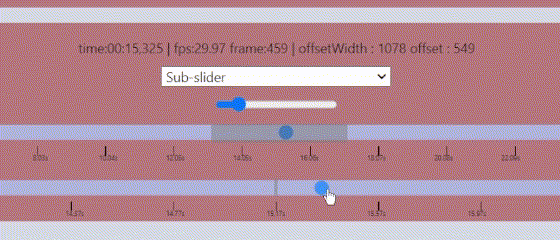

# Projet de navigation vidéo

**auteur :** David ADAMOV

## Description du projet

L'objectif de ce projet est de faire une plateforme pour tester et présenter les différentes techniques de navigation permettant d'avancer ou de reculer dans la vidéo.
Le problème lorsqu'on navigue dans une vidéo, c'est que souvent, le nombre de pixels sur la barre de navigation peut être inférieur au nombre d'images dans la vidéo, ce qui fait que lorsqu'on bouge d'un pixel dans une vidéo assez long, on saute plusieurs images dans la navigation de la vidéo.

## Comment Lancer le projet ?

### Installer NodeJS

Tout d'abord, Il faut installer nodeJS. Les instructions d'installation sont sur le site web ci-dessous  : 

[INSTALLER NODEJS](https://nodejs.org/fr/download/package-manager)

### Installer l'application

Une fois nodeJS installé, sur le terminal, tapez cette commande dans le répertoire où se situe le projet :

```shell
npm install
```

### Lancer l'application
Une fois que la commande `npm install` a été fait, pour lancer le serveur web, tapez cette commande sur le terminal :
```shell
npm run dev
```
- Le projet est accessible sur navigateur web en utilisant l'addresse **http://localhost:5173**.
- Il est aussi possible d'accéder à l'application web directement sur le serveur, une fois lancé, en tapant sur `o` puis sur `Entrée`

### Installer python 3.12 (facultatif)
Certains commandes comme l'importation des vidéos au sein du projet sous certaines condidtions utilisent Python 3.12. : 

[INSTALLER PYTHON](https://www.python.org/downloads/)

### Les outils techniques utilisées
Avant de lancer l'application, il faut savoir que ce projet est fait avec [React 18.2](https://react.dev/), [Vite 5.2](https://vitejs.dev/), [Typescript 5.2.2](https://www.typescriptlang.org/), et [Bootstrap 5.3.3](https://getbootstrap.com/).

Pour en savoir plus, tout les outils utilisées pour l'application (*à l'exeption de python*) sont disponibles sur le fichier [package.json](./package.json).

## Ajouter une vidéo sur l'application
Par défaut, cette application contient deux vidéos très courtes. Une en format mp4 et une faite à partir des données json. Ces données sont sur le dossier [./data/medias](./data/medias).

### ETAPE 1 : placer la vidéo sur le dossier ./datas/medias
#### déposer un fichier vidéo (format .mp4, .webm, .mov, etc...)
Pour ajouter une vidéo, téléchargez-le si cela n'est pas déjà fait et redirigez-vous sur le dossier/répertoire [./data/medias](./data/medias) et ajoutez-y la vidéo que vous souhaitez.

il existent plusieurs outils pour télécherger une vidéo sur youtube :

- sur un site web comme [notube](https://notube.lol/fr/youtube-app-2)
- sur le terminal avec [yt-dlp](https://github.com/yt-dlp/yt-dlp)

#### **experimental** : générer une animation svg avec python
Il existe un ficher [python](#installer-python-312-facultatif) qui génère un fichier json pour les animations en SVG. Pour ce faire, redirigez vous sur [./data](./data) et éxécutez la commande suivante :
```shell
python3 create_svg_video.py 
```
Cela crée un autre fichier json dans le répertoire [./data/medias](./data/medias).
Notez que ce fichier n'est encore pas abouti et par conséquent contient des bugs.

### ÉTAPE 2 : mettre à jour les données vidéos de l'application.

#### Mettre à jour les données avec ffprobe
Si vous possedez l'outil [ffmpeg](https://www.ffmpeg.org/), il est possible de mettre à jour les données des vidéos dans l'application en éxécutant cette commande sur le [répértoire principal](.): 
```shell
npm run generate_videos
```
ou bien
```shell
python3 read_media.py ./data/medias
```
**ATTENTION** : ce programme n'a été conçue que pour les fichiers `mp4` et `json`. pour tout les autres formats, il faut le faire manuellement.

#### Mettre à jour les données manuellement
Pour ajouter manuellement les fichiers dans le code, il suffit d'ajouter dans le fichier [./data/medias_info.json](./data/medias_info.json) les données comme ceci :
```json
"<NOM DU FICHIER>.<mp4/mov/webm/json/...>" : {
    "streams": [
        {
            "avg_frame_rate": "<FRÉQUENCE D'IMAGES>/1",
            "duration": "<DURÉE>"
        }
    ]
}
```
- `<NOM DU FICHIER>` : Le nom du fichier tel qu'il est décrit dans le dossier [./data/medias](./data/medias/)
- `<FRÉQUENCE D'IMAGES>` : la fréquence d'images *en fps* accessible via clic droit puis propriétés.
- `<DURÉE>` : la durée de la vidéo *en secondes* accessible via clic droit puis propriétés.

## Les Techniques d'interactions

### L'intéraction avec le clavier

- Nous pouvons naviguer les vidéos sur internet en utilisant les claviers. Pour avancer nous utilisons la touche droite, pour reculer, la touche gauche, espace pour 
lancer ou faire une pause dans la vidéo, etc... .

#### Les contrôles
- `Espace` : Lancer/pauser la vidéo
- `touche gauche/droite` : Déplacement de la vidéo
- `touche haut/bas` : augmenter/diminuer la vitesse de déplacement de la vidéo
- `touche 1`: changer l'unité de navigation vidéo en secondes
- `touche 2` : changer l'unité de navigation vidéo en images (ou frames)
- `touche 3` : changer l'unité de navigation vidéo en pixels

### le Context Slider


- Sur Youtube, lorsqu'on maintien le clic sur la barre de navigation et qu'on glisse en haut, une autre barre s'affiche nous permettant de naviguer la vidéo plus en détail.
- Dans le cadre de ce projet, nous allons faire naviguer la vidéo frame par frame sur cette deuxième barre (contrairement à Youtube qui fonctionne différement.)

### Le volant / gouvernail


- Au lieu de naviguer dans la sous partie du slider de navigation, je la *dirige*. C'est à dire que plus le curseur du deuxième slider est à droite, plus vite on avance dans la vidéo, et plus le curseur est à gauche, plus vite on recule.

### le Zoom Slider : la navigation à 2 dimensions 


- On navigue la vidéo à deux dimensions. On gère le temps de la vidéo sur l'axe horizontale, et sur l'axe verticale, on gère la précision de la navigation : Plus on va en haut, plus on est précis.
> [ W. Hurst and P. Jarvers, "Interactive, dynamic video browsing with the zoomslider interface," 2005 IEEE International Conference on Multimedia and Expo, Amsterdam, Netherlands, 2005, pp. 4 pp.-, doi: 10.1109/ICME.2005.1521484.](https://ieeexplore.ieee.org/abstract/document/1521484)

### le subpixel 
- Cette méthode est basée sur le gain par rapport à la vitesse du mouvement 
- Plus on bouge vite, plus la souris accelère. Plus on bouge lentement, plus le déplacement deviens précis. 
- Un des problèmes principales de la majorité des méthodes de capture de souris c'est que les données récoltées du mouvement de la souris correspond plus au mouvement du **pointeur** (*càd l'icône du curseur affiché sur l'écran*) plutôt que le mouvement direct de la souris qui peut avoir une différence certes légère, mais qui devient de plus en plus important suite à une meilleure performance du matériel notamment. 
- **! ATTENTION ! :** *cette méthode de navigation utilise une propriété JS qui est experimentale, Il est avisé de ne pas utiliser* **Firefox** *et* **Safari** *et de privilégier* **Chrome***,* **Edge** *ou* **Opera** *pour une expérience plus adéquate.*
- **! ATTENTION ! :** *cette technique de navigation vidéo ne marche pas sur* **Linux***.*
> [Roussel, N., Casiez, G., Aceituno, J., & Vogel, D. (2012, October). Giving a hand to the eyes: leveraging input accuracy for subpixel interaction. In Proceedings of the 25th annual ACM symposium on User interface software and technology (pp. 351-358).](https://dl.acm.org/doi/abs/10.1145/2380116.2380162)

### DIMP : Interagir avec l'objet
- L'objectif avec la méthode de navigation DIMP, c'est de pouvoir naviguer la vidéo à partir des éléments qui se déplacent dans la vidéo.
- **Cette méthode de navigation vidéo ne fonctionne uniquement avec les vidéos en svg importées à partir des données JSON**
> [P. Dragicevic, G. Ramos, J. Bibliowitcz, D. Nowrouzezahrai, R. Balakrishnan, and K. Singh, “Video browsing by direct manipulation,” in Proceeding of the twenty-sixth annual CHI conference on Human factors in computing systems - CHI ’08, Florence, Italy: ACM Press, 2008, p.237. doi: 10.1145/1357054.1357096](https://dl.acm.org/doi/abs/10.1145/1357054.1357096)

